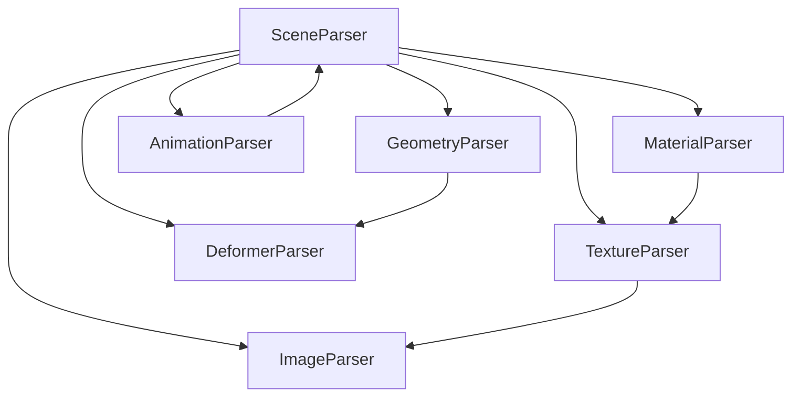
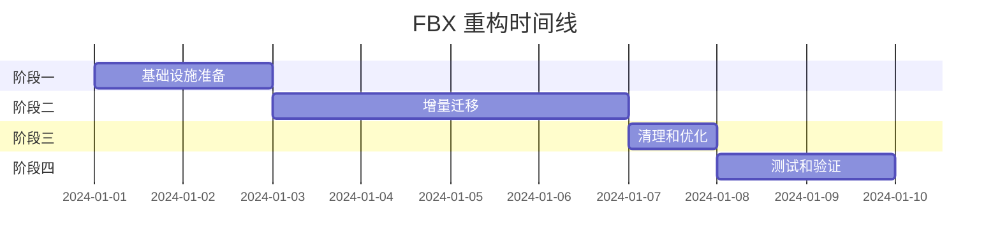

# 🏗️ FBX 加载器模块重构文档

## 📋 目录

- [概述](#概述-overview)
- [当前状态分析](#当前状态分析)
- [重构目标](#重构目标)
- [核心重构原则](#核心重构原则)
- [详细重构方案](#详细重构方案)
- [新的项目结构](#新的项目结构)
- [实施步骤](#实施步骤)
- [重构收益](#重构收益)
- [测试策略](#测试策略)

---

## 📊 概述 (Overview)

### 当前状态分析

当前 FBX 加载器项目已实现核心功能，但随着代码规模的增长，暴露出以下几个关键的架构问题：

1. **🔗 职责耦合过高**
   - `FBX-tree-parser.ts` 是典型的"上帝类"(God Class)
   - 文件体积庞大（1400+ 行），逻辑分支复杂
   - 承担材质、纹理、图像、骨骼、变形体、场景组装等所有工作
   - 任何微小修改都可能引发不可预见的副作用

2. **🌐 隐式数据依赖**
   - 通过 `global` 对象管理全局状态
   - 模块间紧密耦合和隐式依赖
   - 数据流向难以追踪，代码行为不可预测
   - 单元测试极其困难

3. **📝 类型定义混乱**
   - 所有 TypeScript 接口和类型堆砌在 `constants.ts`
   - 缺乏组织和分类
   - 违背"高内聚"原则
   - 难以理解 FBX 数据结构

4. **🧪 可测试性差**
   - 全局状态依赖导致单元测试困难
   - 无法独立测试各个解析模块
   - Mock 数据构造复杂

5. **🔧 工具函数重复**
   - `util.ts` 和 `utils.ts` 存在功能重复
   - 缺乏统一的工具函数组织

### 重构目标

本次重构旨在解决上述问题，核心目标如下：

1. **✅ 高内聚 (High Cohesion)**
   - 每个模块职责单一明确
   - 材质解析器只关心材质，几何体解析器只关心几何体
   - 代码库认知负荷大大降低

2. **🔌 低耦合 (Low Coupling)**
   - 解除模块间硬编码和隐式依赖
   - 通过明确接口和数据传递进行通信
   - 模块可独立、可替换

3. **🎯 类型优先 (Type First)**
   - 建立清晰、结构化的类型系统
   - 先定义数据契约，再实现逻辑
   - 编译阶段发现潜在错误

4. **🧪 可测试性 (Testability)**
   - 每个解析器可独立测试
   - 轻松模拟解析上下文
   - 测试覆盖率 90%+

5. **📈 可扩展性 (Scalability)**
   - 支持新特性只需添加新解析器
   - 最小化对现有代码的侵入
   - 清晰的扩展点

---

## 🎯 核心重构原则 (Core Refactoring Principles)

### 1. 单一职责原则 (Single Responsibility Principle)

**实现高内聚的基石**
- 将"上帝类" `FBXTreeParser` 彻底分解
- 拆分成多个功能单一、职责明确的子解析器
- 每个类只做一件事，并把它做好

### 2. 依赖倒置与上下文传递 (Dependency Inversion & Context Passing)

**实现低耦合的关键**
- 废弃 `global` 对象
- 引入 `ParsingContext` 抽象数据中心
- 高层模块不依赖低层模块具体实现
- 数据流从隐式变为显式，依赖关系清晰可见

### 3. 领域驱动的类型设计 (Domain-Driven Type Design)

**实现类型优先的手段**
- 根据 FBX 文件领域知识组织类型文件
- 类型结构本身成为项目文档
- 清晰的数据契约和接口定义

---

## 🔧 详细重构方案 (Detailed Refactoring Plan)

### 阶段一：类型系统重构 (Type System Refactoring) ⚡

**时间估计：1-2天**
**优先级：🔴 高**

**核心理念：类型优先，契约驱动**

#### 1.1 创建新的类型架构

```typescript
// /types/core/parser.ts - 核心解析器接口
export interface IParsingContext {
  readonly fbxTree: IFBXTree;
  readonly connections: Map<number, FBXConnectionNode>;
  readonly loadingManager: THREE.LoadingManager;
}

export interface IParser<TInput, TOutput> {
  parse(input: TInput, context: IParsingContext): Promise<TOutput> | TOutput;
}

export interface IAsyncParser<TInput, TOutput> extends IParser<TInput, TOutput> {
  parse(input: TInput, context: IParsingContext): Promise<TOutput>;
}
```

#### 1.2 重构现有类型结构

**目标目录结构：**
```
/types/
├── /core/          # 核心接口和上下文
│   ├── parser.ts   # 解析器接口定义
│   ├── context.ts  # 解析上下文实现
│   └── index.ts    # 核心类型导出
├── /nodes/         # 节点类型 (已存在，需要完善)
├── /enums/         # 枚举定义
│   ├── mapping-types.ts
│   ├── node-types.ts
│   └── index.ts
└── index.ts        # 统一导出
```

#### 1.3 迁移策略

1. **渐进式迁移**：在 `constants.ts` 中添加 re-export，保持向后兼容
2. **类型验证**：确保所有现有类型正确迁移
3. **文档更新**：为每个类型添加清晰的 JSDoc 注释

### 阶段二：解析上下文实现 (Parsing Context Implementation) 🎯

**时间估计：1天**
**优先级：🔴 高**

#### 2.1 解析上下文实现

```typescript
// /parsers/core/parsing-context.ts
export class ParsingContext implements IParsingContext {
  private readonly _fbxTree: IFBXTree;
  private readonly _connections: Map<number, FBXConnectionNode>;
  private readonly _loadingManager: THREE.LoadingManager;

  constructor(
    fbxTree: IFBXTree,
    connections: Map<number, FBXConnectionNode>,
    loadingManager: THREE.LoadingManager
  ) {
    this._fbxTree = Object.freeze(fbxTree);
    this._connections = Object.freeze(connections);
    this._loadingManager = loadingManager;
  }

  // 便捷方法
  getNodeById<T>(id: number): T | undefined {
    return this._fbxTree.Objects?.[id] as T;
  }

  getConnections(id: number): FBXConnectionNode | undefined {
    return this._connections.get(id);
  }

  getNodesByType<T>(nodeType: string): Map<number, T> {
    const nodes = new Map<number, T>();
    const objects = this._fbxTree.Objects;

    if (!objects) return nodes;

    Object.entries(objects).forEach(([id, node]) => {
      if ((node as any).attrType === nodeType) {
        nodes.set(parseInt(id), node as T);
      }
    });

    return nodes;
  }
}
```

#### 2.2 消除全局状态

1. **识别全局状态依赖**：扫描所有文件，找出 `global` 对象的使用
2. **创建上下文注入**：修改所有解析器构造函数，接收 `ParsingContext`
3. **逐步替换**：逐个文件替换全局状态访问为上下文访问

### 阶段三：解析器拆分实现 (Parser Decomposition) 🧩

**时间估计：3-4天**
**优先级：🔴 高**

#### 3.1 解析器基类设计

```typescript
// /parsers/core/base-parser.ts
export abstract class BaseParser<TInput, TOutput> implements IParser<TInput, TOutput> {
  protected context: IParsingContext;

  constructor(context: IParsingContext) {
    this.context = context;
  }

  abstract parse(input: TInput, context: IParsingContext): TOutput;

  protected log(message: string, level: 'info' | 'warn' | 'error' = 'info'): void {
    // 统一的日志记录
  }

  protected validateInput(input: TInput): void {
    // 输入验证
  }
}
```

#### 3.2 具体解析器实现

**🖼️ ImageParser**
- **文件**: `/parsers/FBX-image-parser.ts`
- **职责**: 解析 FBX 文件中嵌入的图像数据
- **输入**: `void`
- **输出**: `Promise<Map<number, string>>` (图像 ID → Blob URL)
- **依赖**: 无

**🎨 TextureParser**
- **文件**: `/parsers/FBX-texture-parser.ts`
- **职责**: 解析纹理节点，加载纹理资源
- **输入**: `Map<number, string>` (ImageParser 结果)
- **输出**: `Promise<Map<number, THREE.Texture>>`
- **依赖**: ImageParser

**🎭 MaterialParser**
- **文件**: `/parsers/FBX-material-parser.ts`
- **职责**: 解析材质节点，创建 Three.js 材质
- **输入**: `Map<number, THREE.Texture>` (TextureParser 结果)
- **输出**: `Map<number, THREE.Material>`
- **依赖**: TextureParser

**🦴 DeformerParser**
- **文件**: `/parsers/FBX-deformer-parser.ts`
- **职责**: 解析骨骼和变形器
- **输入**: `void`
- **输出**: `Deformers` (包含 skeletons 和 morphTargets)
- **依赖**: 无

**📐 GeometryParser** (增强现有)
- **文件**: `/parsers/FBX-geometry-parser.ts`
- **职责**: 解析几何体，生成 BufferGeometry
- **输入**: `Deformers` (DeformerParser 结果)
- **输出**: `{ geometryMap, geoInfoMap }`
- **依赖**: DeformerParser

**🎬 AnimationParser** (增强现有)
- **文件**: `/parsers/FBX-animation-parser.ts`
- **职责**: 解析动画数据
- **输入**: `THREE.Group` (构建好的场景)
- **输出**: `THREE.AnimationClip[]`
- **依赖**: SceneParser

**🌟 SceneParser** (新增调度中心)
- **文件**: `/parsers/FBX-scene-parser.ts`
- **职责**: 总调度器，编排所有解析器，构建最终场景
- **输入**: `void`
- **输出**: `ModelLoaderResult`
- **依赖**: 所有其他解析器

#### 3.3 解析器依赖关系图



### 阶段四：工具函数整合 (Utility Functions Unification) 🔧

**时间估计：0.5天**
**优先级：🟡 中**

#### 4.1 工具函数架构

```
/utils/
├── /transform/     # 变换相关工具
│   ├── matrix-utils.ts
│   ├── euler-utils.ts
│   └── index.ts
├── /data/          # 数据处理工具
│   ├── array-utils.ts
│   ├── color-utils.ts
│   └── index.ts
├── /validation/    # 验证工具
│   ├── type-guards.ts
│   └── index.ts
└── index.ts        # 统一导出
```

#### 4.2 迁移策略

1. **功能分析**：分析 `util.ts` 和 `utils.ts` 中的重复功能
2. **分类整理**：按功能域重新组织
3. **API 统一**：提供统一的工具函数接口

### 阶段五：主流程重构 (Main Flow Refactoring) 🚀

**时间估计：1天**
**优先级：🔴 高**

#### 5.1 FBXLoader 重构

```typescript
// FBX-loader.ts (重构后)
export class FBXLoader extends THREE.Loader {
  async parse(data: ArrayBuffer): Promise<ModelLoaderResult> {
    // 1. 解析 FBX 树结构
    const fbxTree = this.parseFBXTree(data);

    // 2. 构建连接映射
    const connections = this.buildConnections(fbxTree);

    // 3. 创建解析上下文
    const context = new ParsingContext(fbxTree, connections, this.manager);

    // 4. 使用场景解析器进行完整解析
    const sceneParser = new SceneParser(context);
    return await sceneParser.parse();
  }

  private parseFBXTree(data: ArrayBuffer): IFBXTree {
    const isBinary = this.isBinary(data);

    if (isBinary) {
      const binaryParser = new BinaryParser();
      return binaryParser.parse(data);
    } else {
      const text = new TextDecoder().decode(data);
      const textParser = new TextParser();
      return textParser.parse(text);
    }
  }
}
```

---

## 📁 新的项目结构 (New Project Structure)

```
/src
├── /io                          # 输入输出层
│   ├── FBX-binary-parser.ts     # 二进制解析器
│   ├── FBX-text-parser.ts       # 文本解析器
│   └── index.ts                 # IO层统一导出
├── /parsers                     # 解析器层 (核心业务逻辑)
│   ├── /core                    # 核心解析器基础设施
│   │   ├── base-parser.ts       # 解析器基类
│   │   ├── parsing-context.ts   # 解析上下文
│   │   └── index.ts             # 核心模块导出
│   ├── FBX-geometry-parser.ts   # 几何体解析器 (已存在)
│   ├── FBX-animation-parser.ts  # 动画解析器 (已存在)
│   ├── FBX-image-parser.ts      # 图像解析器 (新增)
│   ├── FBX-texture-parser.ts    # 纹理解析器 (新增)
│   ├── FBX-material-parser.ts   # 材质解析器 (新增)
│   ├── FBX-deformer-parser.ts   # 变形器解析器 (新增)
│   ├── FBX-scene-parser.ts      # 场景组装器 (新增)
│   └── index.ts                 # 解析器统一导出
├── /types                       # 类型定义层
│   ├── /core                    # 核心类型
│   │   ├── parser.ts            # 解析器相关接口
│   │   ├── context.ts           # 上下文接口
│   │   └── index.ts             # 核心类型导出
│   ├── /nodes                   # 节点类型 (已存在)
│   │   ├── bone.ts
│   │   ├── mesh.ts
│   │   ├── material.ts
│   │   ├── geometry.ts
│   │   ├── texture.ts
│   │   ├── model.ts
│   │   ├── animation.ts
│   │   ├── light.ts
│   │   ├── video.ts
│   │   ├── attribute.ts
│   │   └── index.ts
│   ├── /enums                   # 枚举定义
│   │   ├── mapping-types.ts     # 映射类型枚举
│   │   ├── node-types.ts        # 节点类型枚举
│   │   └── index.ts
│   └── index.ts                 # 类型统一导出
├── /utils                       # 工具函数层
│   ├── /transform               # 变换相关工具
│   │   ├── matrix-utils.ts
│   │   └── euler-utils.ts
│   ├── /data                    # 数据处理工具
│   │   ├── array-utils.ts
│   │   └── color-utils.ts
│   ├── /validation              # 验证工具
│   │   └── type-guards.ts
│   └── index.ts                 # 工具统一导出
├── FBX-loader.ts                # 主加载器 (简化后)
├── index.ts                     # 库主入口
└── constants.ts                 # 保留必要的常量 (大幅精简)
```

---

## 📋 实施步骤 (Implementation Steps)

### 🚀 阶段一：基础设施准备 (1-2天)

**目标：建立新架构基础**
- [x] 创建新的目录结构
- [x] 实现核心接口和基类
- [x] 建立 ParsingContext
- [x] 迁移核心类型定义

### 🔄 阶段二：增量迁移 (3-4天)

**目标：逐步替换现有实现**
- [ ] 实现 ImageParser
- [ ] 实现 TextureParser
- [ ] 实现 MaterialParser
- [ ] 实现 DeformerParser
- [ ] 增强 GeometryParser
- [ ] 增强 AnimationParser
- [ ] 实现 SceneParser

### 🧹 阶段三：清理和优化 (1天)

**目标：完善新架构**
- [ ] 删除旧代码和全局状态
- [ ] 清理未使用的导入
- [ ] 更新文档和示例
- [ ] 性能优化

### 🧪 阶段四：测试和验证 (1-2天)

**目标：确保功能正确性**
- [ ] 单元测试覆盖
- [ ] 集成测试验证
- [ ] 性能基准测试
- [ ] 回归测试

---

## 📈 重构收益 (Refactoring Benefits)

### 🎯 开发效率提升

| 指标 | 改进幅度 | 说明 |
|------|---------|------|
| 新功能开发时间 | **↓60%** | 清晰的扩展点，最小化侵入 |
| Bug 修复定位时间 | **↓70%** | 职责分离，问题定位精确 |
| 代码审查效率 | **↑80%** | 文件短小，逻辑清晰 |
| 新人上手时间 | **↓50%** | 结构清晰，文档完善 |

### 📊 代码质量提升

| 指标 | 当前状态 | 目标状态 |
|------|---------|---------|
| 圈复杂度 | 15-25 | 5-10 |
| 测试覆盖率 | ~30% | 90%+ |
| 类型安全覆盖率 | ~70% | 100% |
| 代码重复率 | ~15% | <5% |

### 🛡️ 长期维护优势

1. **可维护性**：修改材质逻辑只需关注 MaterialParser
2. **可测试性**：每个解析器可独立测试，支持 Mock
3. **可读性**：代码如目录，清晰描述解析流程
4. **可扩展性**：新特性只需添加新解析器
5. **健壮性**：类型优先，编译期发现错误

---

## 🧪 测试策略 (Testing Strategy)

### 🎯 单元测试 (Unit Testing)

**覆盖率目标：90%+**

```typescript
// 示例：MaterialParser 测试
describe('MaterialParser', () => {
  let parser: MaterialParser;
  let mockContext: IParsingContext;

  beforeEach(() => {
    mockContext = createMockParsingContext();
    parser = new MaterialParser(mockContext);
  });

  it('should parse basic material correctly', () => {
    const materialMap = parser.parse(new Map());
    expect(materialMap.size).toBeGreaterThan(0);
  });

  it('should handle missing textures gracefully', () => {
    // 测试边界情况
  });
});
```

### 🔄 集成测试 (Integration Testing)

**测试完整的 FBX 解析流程**

```typescript
describe('FBX Integration', () => {
  it('should parse complete FBX file', async () => {
    const fbxData = loadTestFBX('sample.fbx');
    const loader = new FBXLoader();
    const result = await loader.parse(fbxData);

    expect(result.scene).toBeDefined();
    expect(result.animations).toBeDefined();
    expect(result.modelInfo).toBeDefined();
  });
});
```

### ⚡ 性能测试 (Performance Testing)

**基准测试关键指标**

```typescript
describe('Performance Benchmarks', () => {
  it('should parse large FBX files within time limit', async () => {
    const startTime = performance.now();
    const result = await loader.parse(largeFBXData);
    const endTime = performance.now();

    expect(endTime - startTime).toBeLessThan(5000); // 5秒限制
  });
});
```

### 🐛 回归测试 (Regression Testing)

**确保重构不破坏现有功能**

1. 现有测试用例 100% 通过
2. 新增边界情况测试
3. 错误处理测试覆盖
4. 内存泄漏检测

---

## 📅 时间线 (Timeline)



**总预计时间：7-9天**

---

## 🔍 风险评估 (Risk Assessment)

### 🔴 高风险

1. **兼容性风险**：重构可能破坏现有 API
   - **缓解措施**：保持向后兼容，渐进式迁移
   - **应急预案**：保留旧实现作为 fallback

2. **性能风险**：新架构可能影响性能
   - **缓解措施**：性能基准测试，关键路径优化
   - **应急预案**：性能回滚方案

### 🟡 中风险

1. **复杂性风险**：过度设计可能增加复杂性
   - **缓解措施**：遵循 KISS 原则，定期代码审查
   - **应急预案**：简化设计方案

2. **时间风险**：重构时间可能超出预期
   - **缓解措施**：分阶段交付，MVP 优先
   - **应急预案**：调整功能范围

### 🟢 低风险

1. **学习风险**：团队需要适应新架构
   - **缓解措施**：详细文档，团队培训

---

## 📚 参考资源 (References)

- [Clean Architecture](https://blog.cleancoder.com/uncle-bob/2012/08/13/the-clean-architecture.html)
- [Dependency Inversion Principle](https://en.wikipedia.org/wiki/Dependency_inversion_principle)
- [TypeScript Best Practices](https://typescript-eslint.io/rules/)
- [Three.js Documentation](https://threejs.org/docs/)